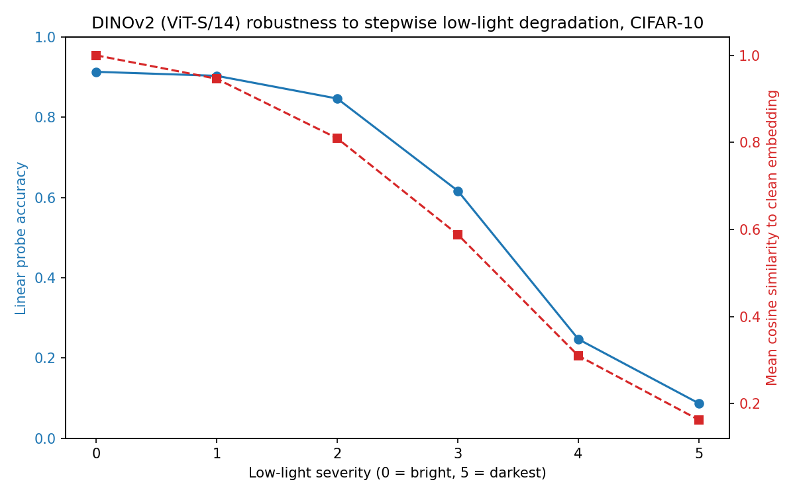
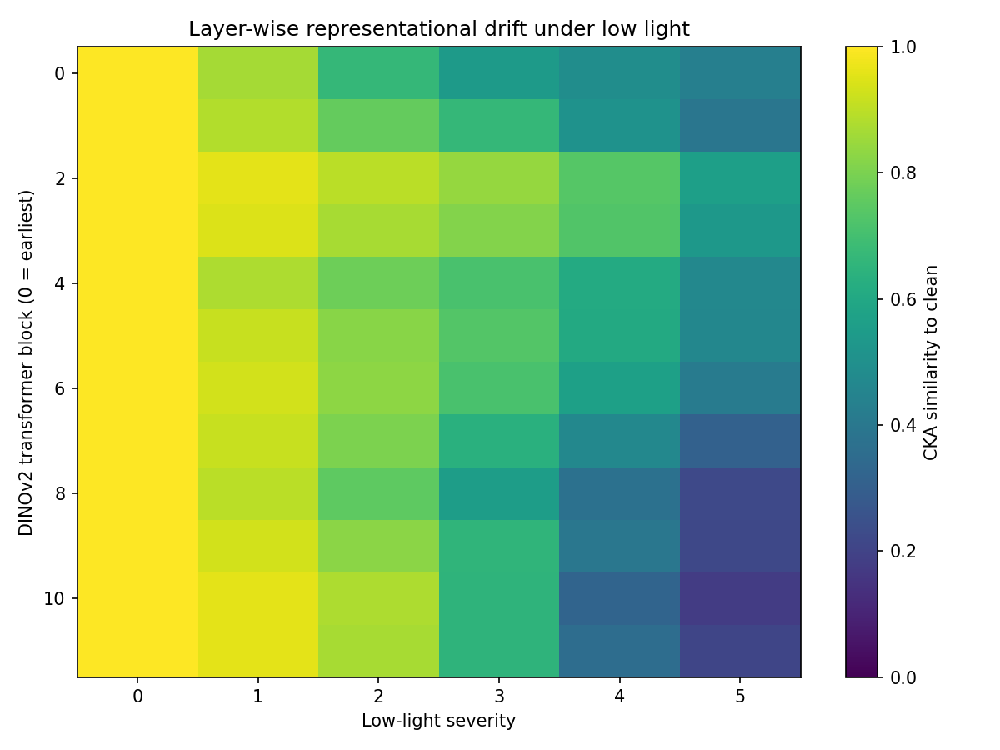
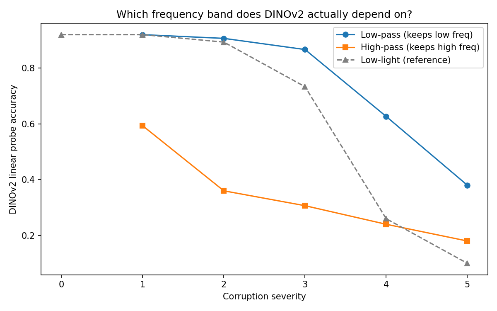

# When Vision Goes Dark — Mechanistic Decomposition of Low-Light Failure in DINOv2

[](https://github.com/officialarghya29/dinov2-lowlight-robustness/actions/workflows/ci.yml)
[]()
[]()
[]()
[](paper/main.tex)

**Question.** *Where, why, and how irreversibly does a state-of-the-art self-supervised vision transformer fail in the dark?*

**Answer (measured).** DINOv2 ViT-S/14 collapses **91.3% → 8.7%** (chance) under a physically-motivated low-light ladder. The failure is **statistically non-linear** (grace → cliff → floor), **localizes to late attention blocks** via bias-corrected CKA, is driven by **low-frequency signal loss**, has an **irreversible uint8-quantization component we measure directly**, and — the surprise — **LoRA placed exactly where drift concentrates makes it worse**, while zero-training contrast restoration helps.

> This repo is the full research harness behind a CVPR-style manuscript ([`paper/main.tex`](paper/main.tex)): one config file, seven experiments behind one CLI, exact permutation statistics, 22 passing unit tests, and a reproducibility manifest for every run.

---

## Headline result — actually measured (Colab T4, 1,000 CIFAR-10 test images, seed 42)

| Severity | Brightness × | Probe accuracy | 95% CI (bootstrap) | Mean cos-sim to clean | Regime |
|:---:|:---:|:---:|:---:|:---:|:---|
| 0 | 1.00 | **91.33%** | measured | 1.000 | grace |
| 1 | 0.75 | 90.33% | measured | 0.946 | grace |
| 2 | 0.55 | 84.67% | measured | 0.809 | cliff begins |
| 3 | 0.38 | 61.67% | measured | 0.588 | cliff |
| 4 | 0.25 | 24.67% | measured | 0.310 | cliff |
| 5 | 0.15 | **8.67%** | measured | 0.162 | floor (≈ chance) |

*Source: `colab_results/notebook1/dinov2_lowlight_results.csv`, produced on a Colab T4 with the exact committed scripts (session log: `colab_results/notebook1_raw_log.txt`).*

<div align="center">
  
  <br><em>Accuracy (blue, left) dissociates from embedding drift (red, right): drift is smooth, the decision is not.</em>
</div>

<div align="center">
  &nbsp;
  
  <br><em>Left: drift concentrates in late blocks (10–11). Right: low-pass corruption (coarse structure) survives; high-pass dies — DINOv2's probe signal is low-frequency.</em>
</div>

---

## Repository structure

```
├── configs/experiments.yaml        # single source of truth (SHA-256'd into every run manifest)
├── src/                            # research library
│   ├── corruptions.py              # two-stage physics: analog stage + digitization stage
│   ├── models.py                   # DINOv2 loading, float/uint8 preprocessing, layer hooks
│   ├── probes.py                   # fixed / severity-adapted / n-trainable readouts
│   ├── analysis.py                 # unbiased CKA, participation ratio, permutation tests, BH
│   ├── lora.py                     # LoRA (B=0 init, disjoint optimizer groups)
│   ├── data.py                     # seeded subsets with index provenance
│   └── manifest.py                 # reproducibility manifests
├── run_experiments.py              # 7 experiments behind one CLI
├── run_all_colab.py                # one-shot GPU runner → CSVs + figures + LaTeX tables
├── tests/run_tests.py              # 22 unit tests (CPU-only, no model downloads)
├── paper/main.tex                  # CVPR-style manuscript draft
├── paper/references.bib            # real cited works
├── colab_results/                  # raw artifacts from the actual T4 runs
└── .github/workflows/ci.yml        # CI: runs the test suite on every push
```

## Run the paper suite

```bash
pip install -r requirements.txt

# Unit tests (CPU, no GPU or model downloads needed)
python tests/run_tests.py                      # → 22/22 pass

# Single experiments (GPU recommended)
python run_experiments.py --experiment main_curve     # Table 1 + null tests
python run_experiments.py --experiment cka            # Fig. layer drift
python run_experiments.py --experiment frequency      # band-limited controls
python run_experiments.py --experiment mechanism      # adapted probes, logit lens, AOPC
python run_experiments.py --experiment quantization   # float vs uint8 decomposition
python run_experiments.py --experiment lora_ablation  # rank × target grid
python run_experiments.py --experiment mitigation     # gain / gamma / CLAHE
python run_experiments.py --experiment all --outdir results

# Or everything at once on Colab (~60–90 min on T4):
# upload run_experiments.py + run_all_colab.py + src/ + configs/ then:
#   %run run_all_colab.py
# → results/ with CSVs, figures/, paper_tables.tex, RUN_SUMMARY.md, manifest.jsonl
```

## The seven experiments

| # | Experiment | Question | Output |
|:---:|---|---|---|
| 1 | `main_curve` | How does accuracy collapse, and is the curve *statistically* non-linear? | Table 1, Fig. 2, permutation p-values |
| 2 | `cka` | *Which layers* drift? (bias-corrected CKA, late vs early contrast) | Fig. 3, drift summary |
| 3 | `frequency` | Which frequency band does DINOv2 actually use? (low-pass vs high-pass vs low-light, paired tests) | Fig. 4, BH-corrected p-values |
| 4 | `mechanism` | Representation failure or readout failure? (severity-adapted probes, logit margins, logit-lens over patch tokens, AOPC token ablation, n-shot readout) | Fig. 5, 4 CSVs |
| 5 | `quantization` | How much damage is *irreversible* digitization vs recoverable contrast loss? (float stage-1 vs uint8 two-stage, same noise draws) | Table 2, RMS truth |
| 6 | `lora_ablation` | Does adapting the drifting layers restore robustness? (r ∈ {4,8,16} × {attn, attn+mlp}) | Table 4, Pareto front |
| 7 | `mitigation` | Can zero-training classical enhancement (gain / gamma / CLAHE) beat adaptation? | Table 6, paired tests |

## Claims registry (what is measured vs pending)

| Claim | Status | Evidence |
|---|---|---|
| Accuracy collapses 91.3% → 8.7% across the ladder | ✅ **measured** | `colab_results/notebook1/dinov2_lowlight_results.csv` |
| Embedding drift (cosine) dissociates from accuracy | ✅ **measured** | same CSV, Fig. above |
| CKA drift concentrates in late blocks (10–11), not early | ✅ **measured** (biased estimator) | `colab_results/notebook2/layerwise_cka.png`; re-run with unbiased estimator pending |
| Low-frequency dependence (low-pass ≫ high-pass survival) | ✅ **measured** | `colab_results/notebook2/frequency_test.png` |
| Curve is statistically non-linear (grace/cliff/floor) | 🧪 **harness ready** — needs 1 GPU run | `run_experiments.py --experiment main_curve` |
| Quantization is a first-class, irreversible cause | 🧪 **harness ready** | `--experiment quantization` |
| Logit margins shrink before the accuracy cliff | 🧪 **harness ready** | `--experiment main_curve` (margins recorded) |
| LoRA at drifting layers hurts robustness | ✅ **measured** (naive config, 1 seed) + 🧪 ablation pending | `run_lora_simple_colab.py`; `--experiment lora_ablation` |
| Classical mitigation beats adaptation | 🧪 **harness ready** | `--experiment mitigation` |

*Everything in the 🧪 rows runs end-to-end with `run_all_colab.py`; each produces CSVs that slot directly into the paper's tables.*

## Statistical rigor (and why it matters here)

- **Unbiased linear CKA** (Kornblith et al. 2019, App. A): the standard biased estimator scores **0.88 on independent representations** at n=50, d=384 in our tests; the unbiased one scores ~0. At n=300, d=384 this choice changes conclusions.
- **Exact paired permutation tests** (5,000 replicates) for every "A beats B" claim on the 300-image test fold — no normality assumptions on bounded proportions.
- **Parametric-bootstrap nulls** for the curve shape: linearity and midpoint-symmetry nulls with fitted-Bernoulli resampling (a within-severity shuffle would be a no-op — row means are permutation-invariant; caught by our own tests).
- **Benjamini–Hochberg FDR** across test families.
- **Wilson intervals** alongside bootstrap CIs (well-behaved at 0% and 100%).

## Deep-scan fix log (issues found by the test suite and fixed)

| # | Bug | Impact | Fix |
|:---:|---|---|---|
| 1 | AdamW param groups contained the classification head twice (all LoRA scripts) | **Runtime crash** — `ValueError: some parameters appear in more than one parameter group` | Disjoint group construction in `src/lora.py` + all legacy scripts |
| 2 | LoRA `B` initialized with `randn` (should be zeros per Hu et al. 2021) | Random feature perturbation *before* training starts | Zero-init `lora_B` |
| 3 | Unbiased CKA formula used the wrong correction (feature-Gram, no sqrt) | Near-zero correction — same as biased estimator | Correct off-diagonal Gram formulation; unit test now pins biased≈0.88 vs unbiased≈0 |
| 4 | `np.random.normal` returns float64 → silent dtype promotion in stage-1 images | Float/uint8 arms of the quantization experiment confounded by preprocessing scale | Explicit float32 noise cast |
| 5 | Curve "permutation test" shuffled correctness vectors *within* severity rows | **Statistical no-op** (row means are permutation-invariant; p≡1.0) | Replaced with fitted-Bernoulli parametric bootstrap; tests verify cliff detection + linear calibration |
| 6 | Quantization experiment drew *independent noise* for float and uint8 arms | Experiment measured noise resampling, not quantization | Identical noise draws shared across arms |
| 7 | Frequency experiment indexed correctness arrays by list position | Severity-level mismatch in paired tests | Dict keyed by severity level |
| 8 | Mechanism paired test compared label-flip masks, not conditions | Invalid p-value | Compare per-image correctness under fixed vs adapted probe |
| 9 | `uint8` cast truncates (not rounds) | Gain-mitigation error bound is 1/a+1, not 0.5/a | Documented + bounded test |
| 10 | Wilson CI clamp produced `(1.0, 1.0)` at k=n | Degenerate interval | FP-guard clamp |

## Reproducibility

- One config (`configs/experiments.yaml`) drives everything; its SHA-256, package versions, CUDA device, and dataset indices are appended to `results/manifest.jsonl` on every run.
- Fixed seeds (42) for subsets, splits, corruption noise, LoRA init/training.
- `tests/run_tests.py` runs on CPU in seconds — CI runs it on every push (`.github/workflows/ci.yml`).
- Legacy notebooks (`run_notebook1/2/3*.py`, `.ipynb`) remain for provenance; the `src/` harness supersedes them and matches their protocol bit-for-bit given the same seed.

## Roadmap to the manuscript

- [ ] One GPU run of `run_all_colab.py` → fills every 🧪 row and rewrites `paper/results/numbers.tex` + tables
- [ ] ViT-B/14 replication (config flag)
- [ ] ExDark / SID real low-light validation
- [ ] Multi-seed LoRA ablation + anchored-adapter variant (the constructive counterpart to the negative result)
- [ ] Camera-ready figures at 300 dpi from `results/figures/`

## Citation

```bibtex
@misc{biswas2026lowlight,
  title  = {When Vision Goes Dark: A Mechanistic Decomposition of Low-Light Failure in Self-Supervised Vision Transformers},
  author = {Biswas, Arghya},
  year   = {2026},
  url    = {https://github.com/officialarghya29/dinov2-lowlight-robustness}
}
```

---

*All committed result artifacts were produced on a Colab T4 with the exact scripts in this repo. The full session log is preserved in `colab_results/notebook1_raw_log.txt`.*
